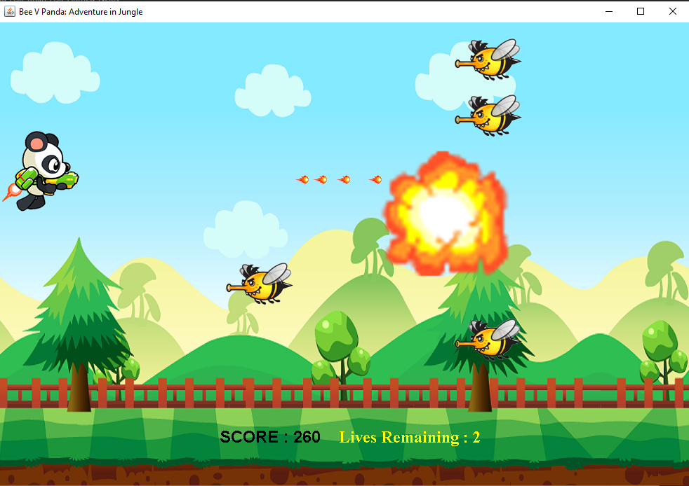
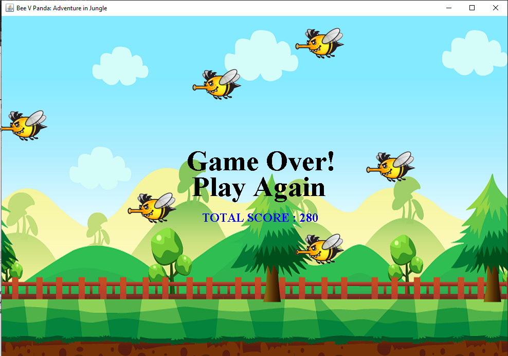

# Bee VS Panda

This project was assigned to me as a student for a laboratory where I had to incorporate programming logic and design patterns such as the abstract factory, decorator, and observer.

## Bee VS Panda

It's a Java shooting game, developed from an academic project done back in March 2016.

---

### Instructions

Simply run `Main.java` to play the game!

### Gameplay

- Use the `space` key to shoot.
- Use the `arrow keys` to navigate.



<hr>

```
You'll have 3 lives to kill bees!
```

